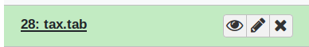
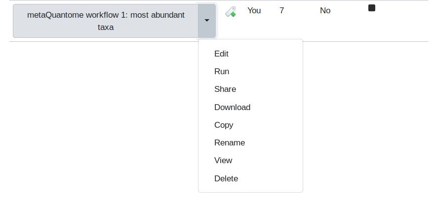
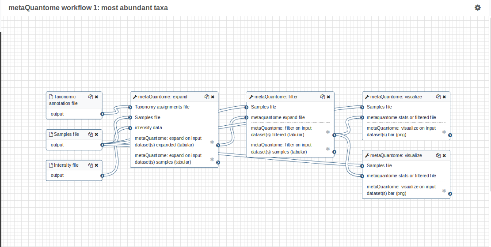
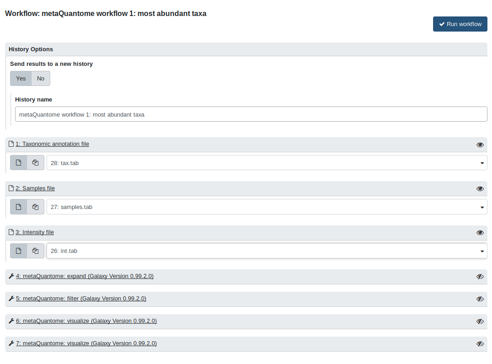
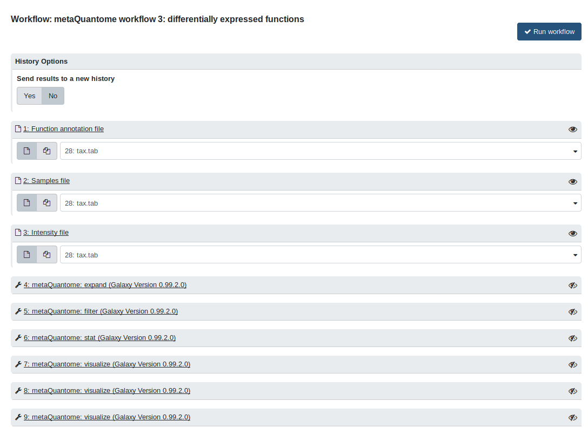
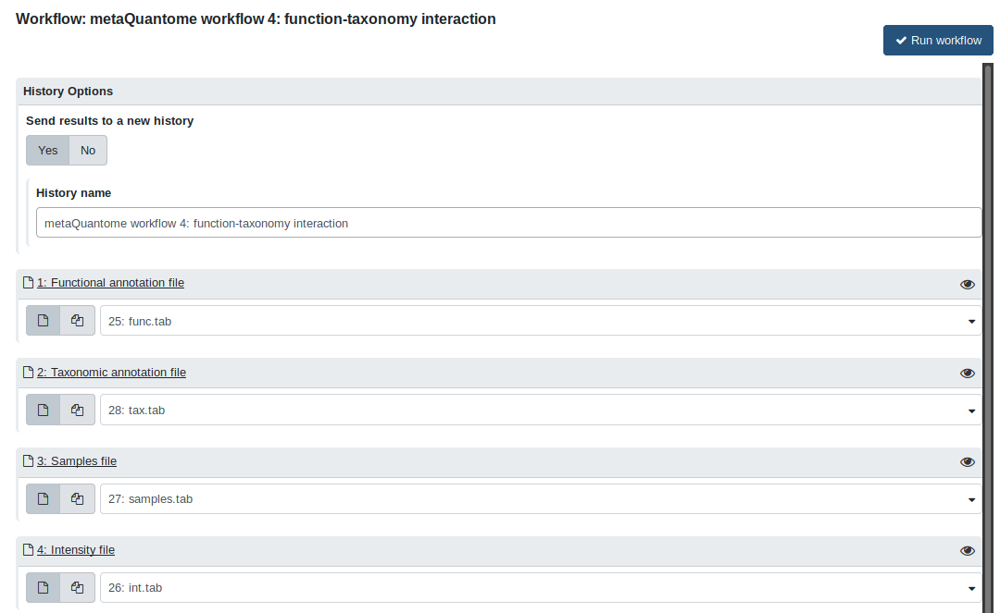

# metaQuantome Galaxy Tutorial

## Accessing the Metaproteomics Gateway

Go to <https://z.umn.edu/metaproteomicsgateway>.  This website is one of the public Galaxy gateways hosted on Jetstream (<https://jetstream-cloud.org/>), a cloud-based resource for scientific computing and research. The Galaxy installation on this website is maintained by the Galaxy-P team at the University of Minnesota.

## Registering

This Galaxy instance requires that all users register to access tools and workflows.  To register, perform the following steps:

1. Click on the  "Login or Register" tab and click on "Register". Enter an email address, password and public name of choosing. [NOTE: Users choosing to remain anonymous can enter an email such as "guest@galaxyp.org", along with a password and a public name of your choosing. Also, note that this instance is for training purposes only, not for long-term use or testing with large datasets and the passwords are non-retrievable]

2. Once registered, click on the "User" tab and click on "Login" with your user credentials.

## The Galaxy Interface
The Galaxy interface is divided into three panels: a *Tool pane* on the left side of the interface, a *Center pane/Main viewing pane* in the center and a *History* pane to the right. The *Tool* pane consists of organized list of software tools available to users in a particular Galaxy instance. The *Main* view displays the information regarding the tool, input/output from the tool, workflow editing space, etc. The *History* pane contains an ordered list of datasets that were uploaded and the outputs generated while running the tools during data analysis.  The active history is shown in the *History Pane* of the user interface.

## Import data

The data used are a downsampled version of data from Rudney, et al. *Microbiome* [doi:10.1186/s40168-015-0136-z](https://dx.doi.org/10.1186/s40168-015-0136-z), using 3 pairs and 1000 peptides (and, as such, these results are not representative of the full dataset). For more detail about the data, see the *MCP* manuscript associated with this tutorial.

In Galaxy, to run any workflow, the appropriate data must be provided to the workflow. Hence, the first step is to import the required input datasets.  To access the inputs for this demonstration, we have provided one history containing all the inputs required to run the tool. Let’s begin by importing the history,  click on "Shared Data" &rarr; "Histories" &rarr; " **metaQuantome MCP tutorial data**". Then, click on to import the history that contains all the input files.  The history consists of four tabular datasets: the samples file (`samples.tab`), functional annotation file (`func.tab`), quantification file (`int.tab`) and taxonomy annotation file (`tax.tab`). You can preview the files in the *Center pane* by clicking on the eye icon:

.

## Running the workflows

Once the files have been imported, these will show up as items in our active history.
We’re now going to run *Workflows* on the input data. The workflows follow the analyses in the command line tutorial (Supplementary Document 1 of the *Mol Cell Proteomics* manuscript).

### Workflow 1: Most Abundant Taxa

The next step is to import the workflow.  There are four workflows for running metaQuantome. The first workflow is the "metaQuantome Workflow 1: Most abundant Taxa". This workflow is used to identify the most abundant taxa in an experiment.

To import this workflow, go to Shared Data &rarr; "Workflows" &rarr; "metaQuantome workflow 1: most abundant taxa". Now, click on Import Workflow [PIC]. Once the workflow is imported, it will now be available in the "Workflow" tab in the Galaxy instance.

First, we'll visualize the steps in the workflow. Go to the "Workflow" tab, and click on the downward-pointing arrow next to "metaQuantome workflow 1: most abundant taxa".

Then, select the "Edit" option. This will display the *Workflow Editor*, which offers the best view of a workflow and is one place that workflows can be built.

By clicking on each of the steps, you can see the parameters that are used in that run of the tool.

Now, go back the the "Workflow" tab. Click the dropdown arrow and select the "Run" option. The workflow will now open in the Main viewing pane. First, select "Yes" for "Send results to a new history", which will keep the input data history clean (for all workflows, you need to be in the input data history when you run it). The default name is fine. Next, to run the workflow, appropriate inputs have to be selected. For the "Taxonomic annotation file" field, select the `tax.tab` file. For the "Samples" file field, select `samples.tab`. Finally, for the "Intensity file" field, select the `int.tab` file. The center pane should now look like this:

Finally, click "Run Workflow". To see the new history with the results, click "Switch to that history" on the page that loads after running the workflow. The workflow has two main outputs: a plot of the highest-abundance species for the no sucrose condition (NS) and another plot for the with sucrose condition (WS). Again, all of the files can be viewed by clicking the eye image .

### Workflow 2: Cluster Analysis of Taxonomy
To run the next workflow, we must first go to the input data history. If you are in a different history, go back to "Imported: metaquantome MCP tutorial data", which you can find by clicking the gear icon in the History pane and going to "Saved Histories":

Then, import the workflow "metaQuantome workflow 2: cluster analysis of taxonomy". The inputs are the same as in the first workflow. After running `expand` and `filter`, this workflow creates a PCA plot and the second creates a heatmap.

### Workflow 3: Differentially Expressed Functions
In workflow 3, we perform functional differential expression analysis with metaQuantome. For this, import workflow 3, "metaQuantome workflow 3: differentially expressed functions". The inputs for workflow 3 are `func.tab` (the "Function annotation file"), `samples.tab` (the "Samples file"), and `int.tab` (the "Intensity file"). After selecting the correct inputs, the center pane should look like this:

The outputs from this workflow are volcano plots, which plots the log2 fold change against the -log10 p value for each GO term. The green points are those GO terms that are below 5% FDR and had a greater-than-2-fold change. The workflow outputs 3 volcano plots, showing different options available within metaQuantome: adding text to the differentially expressed terms and plotting biological process, molecular function, and cellular component separately.

### Workflow 4: Function-Taxonomy Interaction
The fourth workflow analyzes function and taxonomy together. First, import "metaQuantome workflow 4: function taxonomy interaction". Now, we use all 4 inputs from the "Imported: metaquantome MCP tutorial data" history, as follows:

- `func.tab` &rarr; Functional annotation file
- `tax.tab` &rarr; Taxonomic annotation file
- `samples.tab` &rarr; Samples file
- `int.tab` &rarr; Intensity file

The Center Pane should look like this when you are ready to run:

Now, click "Run workflow". The outputs are barplots showing the taxonomic distribution of the GO term for "carbohydrate metabolic process" (GO:0005975) for NS (blue) and WS (orange)

## Contact
If you have any problems with the server or the workflows, please contact the Galaxy-P team by posting an issue on <https://github.com/galaxyproteomics/tools-galaxyp/issues>

## Other training materials

Galaxy has a wealth of training material hosted at the [Galaxy Training webpage](https://galaxyproject.github.io/training-material/). For new users, the [Introduction to Galaxy Analyses](https://galaxyproject.github.io/training-material/topics/introduction/) is a great place to start.
